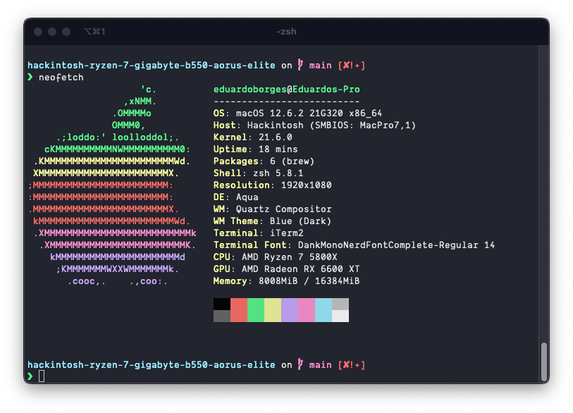

# OpenCore B550M / Ryzen 7 5800X

Updated to OpenCore 0.8.7

## Devices

```
Plataform...: Desktop | AMD Zen3
Processor...: AMD Ryzen™ 7 5800X CPU @ 3.80GHz ~ 4.7GHz
Motherboard.: Gigabyte B550M AORUS ELITE Rev. 1.0
RAM.........: Crucial Ballistix, 2x8GB, 3600MHz, DDR4, CL16
GPU.........: AMD Radeon RX 6600 XT
SSD NVME....: NVMe Xpg 512Gb S41 Tuf M.2
LAN.........: Realtek® GbE LAN chip (1000 Mbit/100 Mbit)
WIFI/BL.....: Intel AX 200
Power Supply: EVGA, 750W,80 Plus,Bronze
SMBIOS......: MacPro7,1
macOS.......: Monterey 12.6.2 (21G320)
Opencore....: 0.8.7
```


